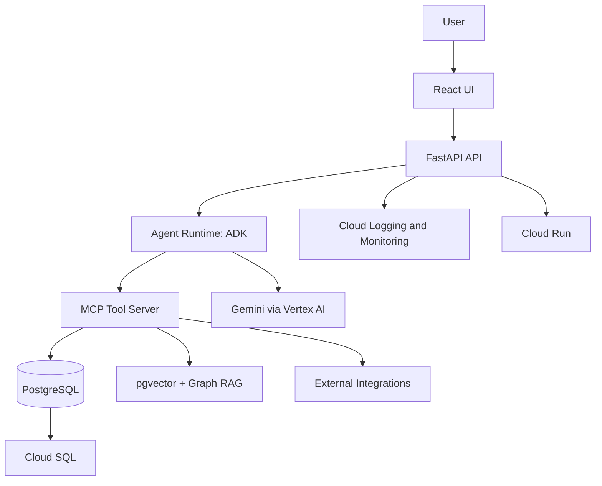
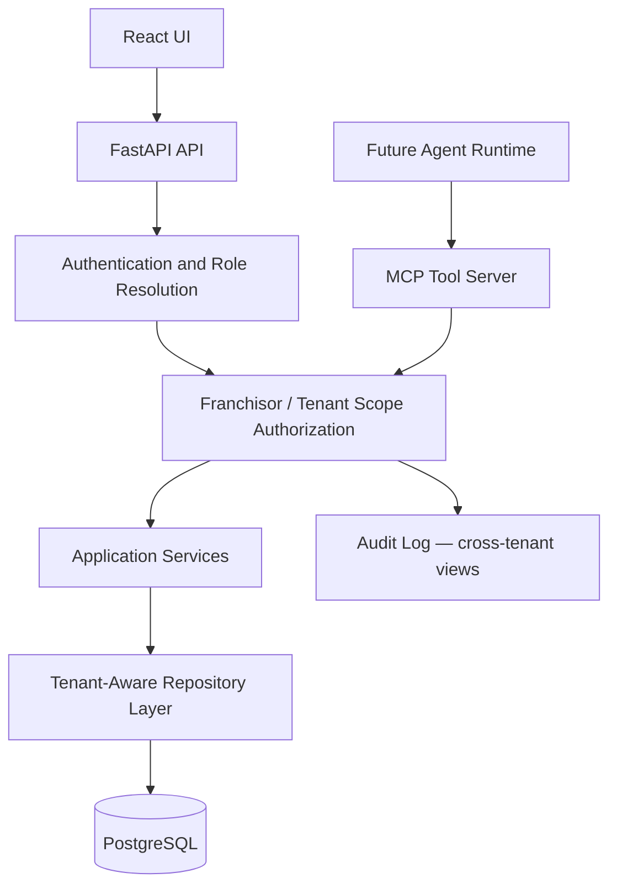

## Backend request flow (v0)

Every request is tenant-scoped before it reaches the data layer — see [`authorization_rules.md`](authorization_rules.md). Tenancy is hierarchical (a franchisor owns many tenant locations), so "tenant context" here means an *authorized* tenant scope resolved from the actor's role — not just a value copied off the request.

`SCOPE` resolves one of: `platform_admin` (any tenant), `franchisor_admin` (any tenant under their `franchisor_id`), `regional_admin` (only tenants with a `user_tenant_access` grant), or `tenant_admin`/`tenant_user` (only their `home_tenant_id`). It never trusts a tenant ID supplied by the caller without re-checking it against the actor's role — a UI location selector is a convenience, not an authorization.