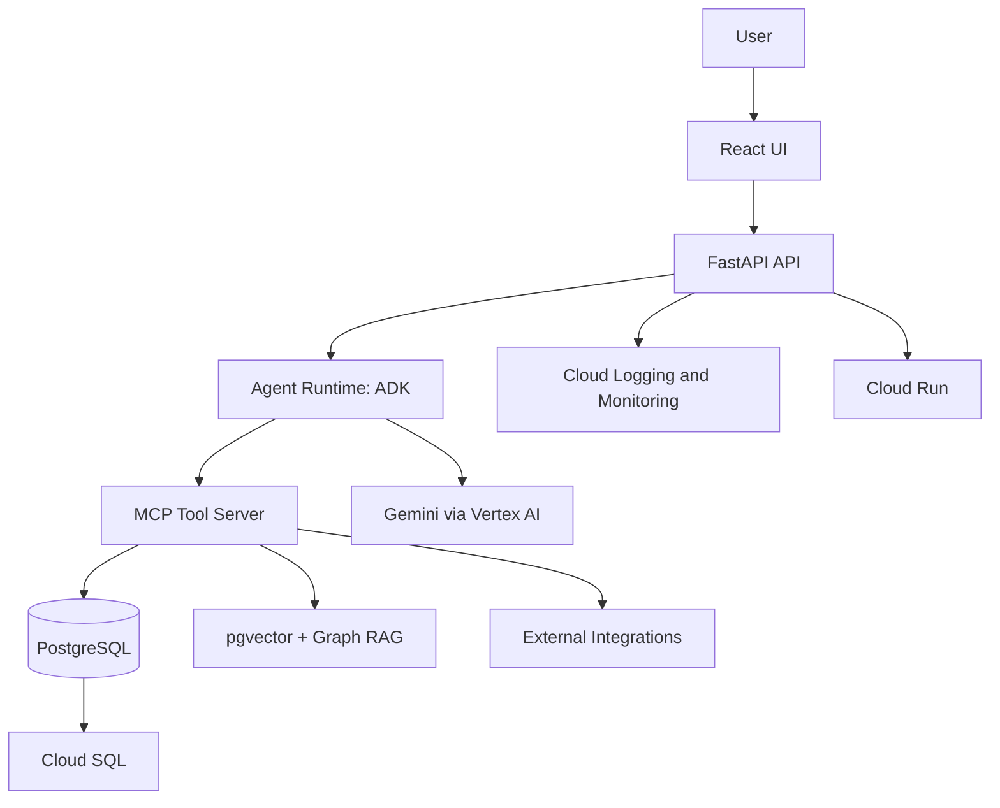

```mermaid
flowchart TD
    U[User] --> UI[React UI]
    UI --> API[FastAPI API]
    API --> AR[Agent Runtime: ADK]
    AR --> MCP[MCP Tool Server]

    MCP --> DB[(PostgreSQL)]
    MCP --> RAG[pgvector + Graph RAG]
    MCP --> EXT[External Integrations]

    AR --> LLM[Gemini via Vertex AI]

    API --> OBS[Cloud Logging and Monitoring]
    DB --> SQL[Cloud SQL]
    API --> RUN[Cloud Run]
```