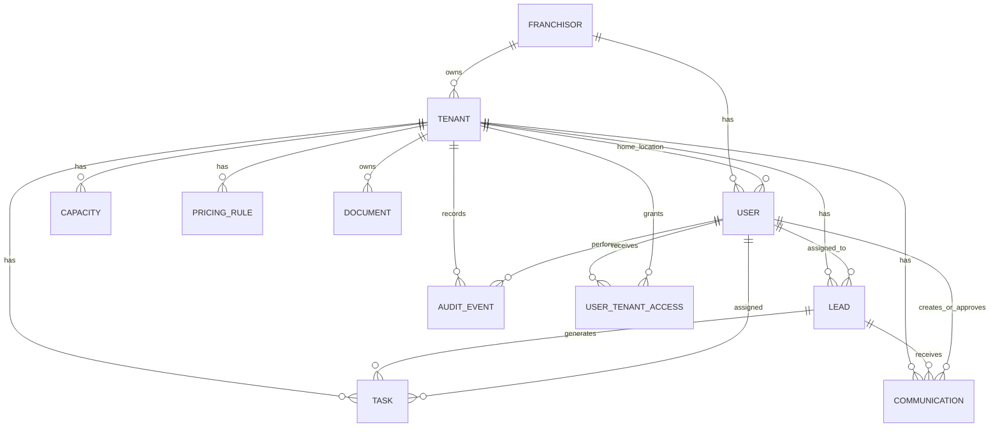

# OpsPilot Data Model v0

Entity summaries and relationships, derived from [`db_schema.md`](db_schema.md). Tenancy is hierarchical: a Franchisor owns many Tenants (locations); a standalone business is simply a Tenant with no Franchisor.

## Franchisor
Represents a franchise organization that owns multiple business locations.

Relationships:
- Has many tenants
- May have franchisor-scoped users (e.g. franchisor admin, regional admin)

## Tenant
Represents one business location using OpsPilot.

Relationships:
- Optionally belongs to one franchisor
- Has many users (home location)
- Has many leads
- Has many capacity records
- Has many pricing rules
- Has many documents
- Has many tasks
- Has many communications
- Has many audit events
- May have many user_tenant_access grants (users given access beyond their home tenant)

## User
Represents a person who uses OpsPilot. Scope comes from role, not a single fixed tenant:
- `tenant_admin` / `tenant_user` — scoped to one `home_tenant_id`
- `franchisor_admin` — scoped to every tenant under one `franchisor_id`
- `regional_admin` — scoped only to tenants explicitly granted via `user_tenant_access`
- `platform_admin` — unscoped

Relationships:
- Optionally belongs to one home tenant
- Optionally belongs to one franchisor
- May have explicit access to additional tenants via user_tenant_access
- May be assigned leads
- May be assigned tasks
- May create or approve communications
- May generate audit events

## UserTenantAccess
Represents an explicit grant of a user to a tenant that isn't their home tenant or covered by franchisor scope — e.g. a regional manager covering two locations, or a read-only auditor.

Relationships:
- Belongs to one user
- Belongs to one tenant
- Carries an access_level (read | write | approve)

## Lead
Represents an inbound customer or business inquiry.

Relationships:
- Belongs to one tenant
- May be assigned to one user
- May have many tasks
- May have many communications
- May be referenced in audit events

## Capacity
Represents availability for a resource, service, team, or program.

Relationships:
- Belongs to one tenant
- May be checked when evaluating a lead

## PricingRule
Represents prices, fees, discounts, eligibility rules, and approval requirements.

Relationships:
- Belongs to one tenant
- May be consulted when analyzing a lead
- May require approval before use (`requires_approval`)

## Document
Represents a policy, playbook, FAQ, or operational document.

Relationships:
- Belongs to one tenant
- Will later have many document chunks
- Is searched by the RAG system

## Task
Represents work assigned to a user.

Relationships:
- Belongs to one tenant
- May belong to one lead
- May be assigned to one user

## Communication
Represents an email, message, or communication draft.

Relationships:
- Belongs to one tenant
- May belong to one lead
- May be created by one user and approved by another
- Moves through a status workflow: draft → pending_approval → approved → sent (or rejected)

## AuditEvent
Records important user, agent, and system actions — including cross-tenant views by franchisor/regional/platform actors.

Relationships:
- Belongs to one tenant (the tenant whose record was affected/viewed)
- May reference a user (human actor) or an agent run (AI actor)
- May reference a franchisor (when access was authorized via franchisor scope)
- References the affected resource (lead, task, communication, pricing rule, etc.)

## Entity-relationship diagram

